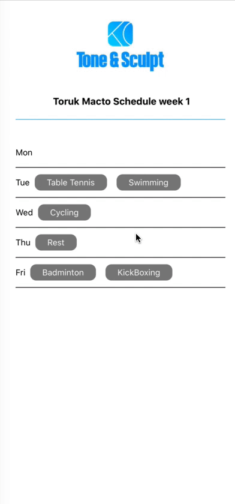

# Tone and Sculpt



## Installation

Scan the QR directly from Expo [snack](https://snack.expo.io/@git/github.com/SerdarMustafa1/TAS-Assignment), or

Clone the repo 

```bash
git clone https://github.com/SerdarMustafa1/TAS-Assignment.git
```

```bash
cd TAS-Assignment
```

```bash
npm install
```

You will also need to install expo-cli:
```bash
npm install -g expo-cli
```

**Some macOS users encounter issues if they do not have Watchman installed on their machine, so if you are using a Mac we recommend that you install it. [Download and install Watchman.](https://facebook.github.io/watchman/docs/install.html)**

## Usage

To run on an iOS simulator, follow the instructions available on the [Expo website.](https://docs.expo.io/versions/v36.0.0/workflow/ios-simulator/)

To run on an actual device. Please first download the expo app from either Google Play or iOS app store. 

iOS: Open camera and scan QR code from your terminal or expo browser.

Android: Open Expo app and click on scan QR code.

## Contributing
Pull requests are welcome. For major changes, please open an issue first to discuss what you would like to change.

## License
[Apache License 2.0](https://opensource.org/licenses/Apache-2.0)